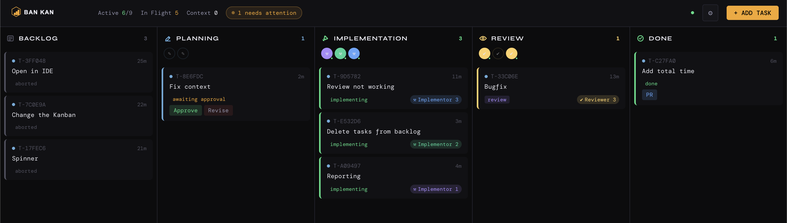

<p align="center">
  
</p>

# Ban Kan

<p align="center">
<strong>Run AI coding agents like a Kanban board.</strong>
</p>

<p align="center">
Plan → Implement → Review → Pull Request
</p>

<p align="center">
  The control center for managing many AI coding agents in one simple UI.
</p>

<p align="center">
Bring order to parallel AI development without leaving your local workflow.
</p>

<p align="center">
  
</p>

<p align="center">
  <a href="https://github.com/stilero/bankan/actions/workflows/ci.yml">CI</a>
  ·
  <a href="https://github.com/stilero/bankan">GitHub</a>
  ·
  <a href="https://github.com/stilero/bankan/issues">Issues</a>
</p>

<p align="center">
⭐ If Ban Kan helps you ship faster, please consider starring the repo.
</p>

---

## What Is Ban Kan

Ban Kan is a **local control center for AI coding agents** that work across real repositories.

Instead of one long AI chat trying to do everything, tasks move through a structured pipeline inspired by a Kanban board:

Backlog → Planning → Implementation → Review → Done

Each stage can use different agents, prompts, and concurrency settings. Developers keep full visibility and control over what is happening at every step.

Ban Kan combines:

- structured workflows
- parallel agent execution
- human approvals
- local repository access
- optional pull request automation

All in one dashboard.

---

## Why Ban Kan Exists

Most AI coding workflows eventually break down in the same way:

- one giant prompt tries to do planning, coding, and review
- context grows and token usage explodes
- agents overwrite each other’s work
- there is no clear review stage
- parallel development becomes chaos

Ban Kan fixes this with a model developers already understand:

**a Kanban board with specialized AI agents.**

Each stage has a clear responsibility, and tasks move forward only when the previous step succeeds.

---

## What It Looks Like In Practice

Example task:

Add Stripe payments

Workflow:

Developer creates task in dashboard  
Planner agent analyzes repository  
Plan generated and shown for approval  
Developer approves plan  
Implementor agent creates feature branch and writes code  
Reviewer agent validates changes  
Task moves to Done and can create a PR

Multiple tasks can run simultaneously with different agents.

---

## Installation

### Run instantly

```bash
npx bankan
```

### Install globally

```bash
npm install -g bankan
bankan
```

### Run from source

```bash
git clone https://github.com/stilero/bankan.git
cd bankan

npm run install:all
npm run setup
npm run dev
```

Ban Kan starts a local server, opens your browser automatically, and serves the dashboard from the same process.

---

## Requirements

- Node.js >= 18
- git
- One AI CLI tool:
  - claude
  - codex
- Native build tools for node-pty

macOS: Xcode Command Line Tools  
Linux: build-essential

---

## Quick Start

1. Launch Ban Kan

```bash
bankan
```

2. Complete the setup wizard

3. Add one or more local repositories

4. Create a task in the dashboard

5. Approve the generated plan

6. Watch agents implement and review the change

7. Optionally create a pull request

---

## How It Works

Developer creates task  
↓  
Planner agent analyzes repository  
↓  
Human reviews and approves plan  
↓  
Implementor agent writes code  
↓  
Reviewer agent validates changes  
↓  
Task moves to Done and optionally creates PR

Multiple tasks can run in parallel across different agents.

---

## Key Features

### Parallel AI agents
Run multiple planning, implementation, and review agents simultaneously.

### Local-first workflow
Repositories stay on your machine. Agents operate directly on local clones and workspaces.

### Human approval gates
Developers approve plans before implementation begins.

### Live agent terminals
Open the terminal of any running agent and take control when needed.

### VS Code workspace support
Open a task workspace directly from the dashboard.

### PR automation
Configure GitHub settings to automatically create pull requests.

### Real-time dashboard
Track:

- active tasks
- blocked tasks
- agent activity
- context usage

---

## CLI

Ban Kan keeps the CLI intentionally simple.

```bash
bankan --port 3005
bankan --no-open
bankan --help
```

Options:

- `--port` bind to a specific port
- `--no-open` start without opening a browser

Most workflows happen inside the dashboard after launch.

---

## Architecture

Ban Kan includes:

- Node / Express backend orchestration
- WebSocket communication for live updates
- React dashboard built with Vite
- CLI launcher that starts the local app
- Configurable planner, implementor, and reviewer agent pools

---

## Development

```bash
npm run setup
npm run dev
```

Useful scripts:

- `npm run build` – build client bundle
- `npm run dev` – run server + Vite client
- `npm run setup` – interactive setup wizard
- `npm run install:all` – install all dependencies

---

## Contributing

Contributions are welcome.

1. Fork the repository
2. Open an issue before starting work
3. Create a focused branch
4. Make your changes
5. Submit a pull request

Screenshots are appreciated for UI updates.

---

## License

MIT
