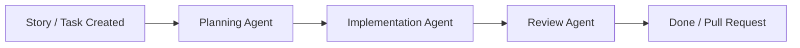
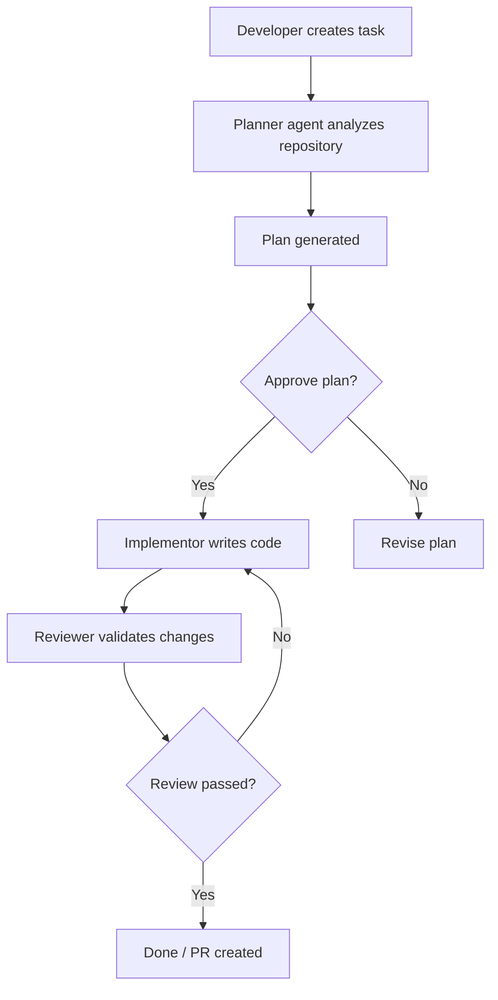

<p align="center">
  
</p>

# Ban Kan

<p align="center">
<strong>Run AI coding agents like a Kanban board.</strong>
</p>

<p align="center">
Plan → Implement → Review → Pull Request
</p>

<p align="center">
  The control center for managing many AI coding agents in one simple UI.
</p>

<p align="center">
Bring order to parallel AI development without leaving your local workflow.
</p>

<p align="center">
  
</p>

<p align="center">
  <a href="https://github.com/stilero/bankan/actions/workflows/ci.yml">CI</a>
  ·
  <a href="https://github.com/stilero/bankan">GitHub</a>
  ·
  <a href="https://github.com/stilero/bankan/issues">Issues</a>
</p>

<p align="center">
⭐ If Ban Kan helps you ship faster, please consider starring the repo.
</p>

---

## What Is Ban Kan

Ban Kan is a **local control center for AI coding agents** that work across real repositories.

Instead of one long AI chat trying to do everything, tasks move through a structured pipeline inspired by a Kanban board:

Backlog → Planning → Implementation → Review → Done

Each stage can use different agents, prompts, and concurrency settings. Developers keep full visibility and control over what is happening at every step.

Ban Kan combines:

- structured workflows
- parallel agent execution
- human approvals
- local repository access
- optional pull request automation

All in one dashboard.

---

## Why Ban Kan Exists

Most AI coding workflows eventually break down in the same way:

- one giant prompt tries to do planning, coding, and review
- context grows and token usage explodes
- agents overwrite each other’s work
- there is no clear review stage
- parallel development becomes chaos

Ban Kan fixes this with a model developers already understand:

**a Kanban board with specialized AI agents.**

Each stage has a clear responsibility, and tasks move forward only when the previous step succeeds.

<table>
  <tr>
    <td align="center" width="50%">
      
      <br />
      <strong>Before Ban Kan</strong>
      <br />
      Managing multiple agents means juggling separate terminal windows and fragmented context.
    </td>
    <td align="center" width="50%">
      
      <br />
      <strong>With Ban Kan</strong>
      <br />
      Tasks, agent stages, approvals, and live output stay visible in one shared dashboard.
    </td>
  </tr>
</table>

---

## Built for Agile Development

Ban Kan fits naturally into Agile workflows where work is organized as stories.

Each story moves through a structured lifecycle that mirrors how real development teams operate:



This structure makes Ban Kan especially useful when working with:

- Agile user stories
- sprint backlogs
- feature tasks
- incremental development

Instead of one AI trying to solve everything in a single prompt, each stage has a clear responsibility — just like in a real Agile team.

Developers plan the story, agents implement the work, reviewers validate the result, and the change moves forward when it meets quality gates.

---

## What It Looks Like In Practice

Example story: **Add Stripe payments**

Below is the same task moving through Ban Kan's workflow from creation to completion.

### 1. Create the task

<p align="center">
  
</p>

The developer creates a task in the dashboard and defines the story to be planned and executed.

### 2. Planning starts

<p align="center">
  
</p>

The planner agent picks up the task, analyzes the repository, and prepares an implementation plan.

### 3. Review and approve the plan

<p align="center">
  
</p>

The generated plan is shown in the dashboard so the developer can approve it before any code is written.

### 4. Implementation runs

<p align="center">
  
</p>

After approval, the implementor agent creates its workspace, writes the code, and reports progress live in the UI.

### 5. Review stage

<p align="center">
  
</p>

The reviewer agent validates the implementation, checks for issues, and decides whether the task is ready to move forward.

### 6. Done / ready for PR

<p align="center">
  
</p>

Once review passes, the task moves to Done and can be used as the basis for a pull request.

Multiple tasks can move through these stages simultaneously with different agents assigned to each step.

---

## Installation

### Run instantly

```bash
npx @stilero/bankan
```

### Install globally

```bash
npm install -g @stilero/bankan
bankan
```

### Run from source

```bash
git clone https://github.com/stilero/bankan.git
cd bankan

npm run install:all
npm run setup
npm run dev
```

Ban Kan starts a local server, opens your browser automatically, and serves the dashboard from the same process.

---

## Requirements

- Node.js >= 18
- git
- One AI CLI tool:
  - claude
  - codex
- Native build tools for node-pty

macOS: Xcode Command Line Tools  
Linux: build-essential

---

## Quick Start

1. Launch Ban Kan

```bash
bankan
```

2. Complete the setup wizard

3. Add one or more local repositories

4. Create a task in the dashboard

5. Approve the generated plan

6. Watch agents implement and review the change

7. Optionally create a pull request

---

## How It Works



Multiple tasks can run in parallel across different agents.

---

## Key Features

### Parallel AI agents
Run multiple planning, implementation, and review agents simultaneously.

### Local-first workflow
Repositories stay on your machine. Agents operate directly on local clones and workspaces.

### Human approval gates
Developers approve plans before implementation begins.

### Live agent terminals
Open the terminal of any running agent and take control when needed.

### VS Code workspace support
Open a task workspace directly from the dashboard.

### PR automation
Configure GitHub settings to automatically create pull requests.

### Real-time dashboard
Track:

- active tasks
- blocked tasks
- agent activity
- context usage

---

## CLI

Ban Kan keeps the CLI intentionally simple.

```bash
bankan --port 3005
bankan --no-open
bankan --help
```

Options:

- `--port` bind to a specific port
- `--no-open` start without opening a browser

Most workflows happen inside the dashboard after launch.

---

## Architecture

Ban Kan includes:

- Node / Express backend orchestration
- WebSocket communication for live updates
- React dashboard built with Vite
- CLI launcher that starts the local app
- Configurable planner, implementor, and reviewer agent pools

---

## Development

```bash
npm run setup
npm run dev
```

Useful scripts:

- `npm run build` – build client bundle
- `npm run dev` – run server + Vite client
- `npm run setup` – interactive setup wizard
- `npm run install:all` – install all dependencies

---

## Contributing

Contributions are welcome.

1. Fork the repository
2. Open an issue before starting work
3. Create a focused branch
4. Make your changes
5. Submit a pull request

Screenshots are appreciated for UI updates.

---

## License

MIT
