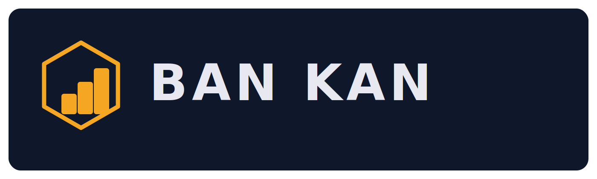

<p align="center">
  
</p>

# Ban Kan

<p align="center">
  The control center for managing many AI coding agents in one simple UI.
</p>

<p align="center">
  See every task, every stage, and every agent at a glance.
</p>

<p align="center">
  Bring order to parallel AI development without leaving your local workflow.
</p>

<p align="center">
  <a href="https://github.com/stilero/bankan/actions/workflows/ci.yml">CI</a>
  ·
  <a href="https://github.com/stilero/bankan">GitHub</a>
  ·
  <a href="https://github.com/stilero/bankan/issues">Issues</a>
</p>

---

## What Is Ban Kan

Ban Kan is a local dashboard for running multiple AI coding agents across real repositories.

Instead of one long chat handling everything, tasks move through a visible pipeline:

`Backlog -> Planning -> Implementation -> Review -> Done`

Each stage can use different agents, different prompts, and different concurrency limits. You get structured handoffs, human plan approval, live status tracking, and optional PR creation from one interface.

---

## Why Developers Star Repos Like This

Most AI coding setups break down the same way:

- one giant prompt tries to do planning, implementation, and review at once
- token usage grows fast as context gets mixed together
- it is hard to see what each agent is doing
- quality gates are inconsistent
- parallel work becomes chaotic

Ban Kan fixes that with a workflow developers already understand: a Kanban board with explicit stages, specialized agents, and local repo control.

---

## What You Can Do Today

- Run planning, implementation, and review agents in parallel
- Route tasks through a visible board with backlog, planning, implementation, review, and done columns
- Require human approval before implementation starts
- Open a live terminal for any running agent and take over when needed
- Open a task workspace directly in VS Code from the task detail modal when a local workspace exists
- Track blocked tasks, active tasks, total context usage, and agent activity in real time
- Point the app at one or more local repositories and a workspace root for per-task working copies
- Tune prompts and per-role concurrency from the UI
- Optionally configure GitHub repo and token settings for PR workflows

---

## How It Works

```text
Developer creates a task in the dashboard
        |
        v
Planner agent analyzes the repository
        |
        v
Human approves or rejects the plan
        |
        v
Implementor agent makes the change
        |
        v
Reviewer agent validates the result
        |
        v
Task moves to Done and can create a PR
```

Multiple tasks can be in flight at the same time, each with its own agent assignment and lifecycle.

---

## Installation

### Requirements

- Node.js `>= 18`
- `git`
- At least one AI CLI: [`claude`](https://docs.anthropic.com/en/docs/claude-code) or [`codex`](https://github.com/openai/codex)
- Native build tools for `node-pty`
  - macOS: Xcode Command Line Tools
  - Linux: `build-essential`

### Run with npm

```bash
npm install -g bankan
bankan
```

### Run without installing

```bash
npx bankan
```

### Run from source

```bash
git clone https://github.com/stilero/bankan.git
cd bankan
npm run install:all
npm run setup
npm run dev
```

By default, Ban Kan starts a local server, opens your browser automatically, and serves the dashboard from the same process.

If you want to open task workspaces from the dashboard, install Visual Studio Code locally. Ban Kan will try the `code` launcher first and, on macOS, fall back to the standard `open -a "Visual Studio Code"` application launch. If neither is available, the task modal shows a readable error instead of failing silently.

---

## Quick Start

1. Launch the app with `bankan` or `npx bankan`.
2. On first run, complete the setup wizard.
3. Add one or more local repositories.
4. Open the dashboard and create a task.
5. Review the generated plan and approve it.
6. Watch the task move through implementation and review.
7. Open the agent terminal if you want to inspect or steer execution.

If you want PR automation, configure `GITHUB_REPO` and `GITHUB_TOKEN` during setup or in your local settings later.

---

## First-Run Setup

On first launch, Ban Kan prompts for:

- `REPOS`: comma-separated absolute paths to local git repositories
- `GITHUB_REPO`: GitHub `owner/repo` for PR creation
- `GITHUB_TOKEN`: GitHub personal access token
- `IMPLEMENTOR_1_CLI`: `claude` or `codex`
- `IMPLEMENTOR_2_CLI`: `claude` or `codex`

The app stores local runtime state outside the global npm install directory:

- macOS: `~/Library/Application Support/bankan`
- Linux: `~/.local/share/bankan` or `$XDG_DATA_HOME/bankan`
- Windows: `%AppData%\\bankan`

---

## Why Ban Kan Feels Different

### Local-first by default

Your repositories stay on your machine. Agents work against local clones and local workspaces instead of a hosted black box.

### Built for parallelism

Planning, implementation, and review can each scale across multiple agents. You are not forced into a single-agent queue.

### Review is part of the system

Review is a first-class stage, not an afterthought. Tasks do not need to jump straight from code generation to completion.

### Human control stays in the loop

Plans can be approved or rejected, terminals can be opened live, and blocked tasks remain visible instead of disappearing into logs.

---

## CLI

Ban Kan is intentionally small at the command line. The CLI launches the local app:

```bash
bankan --port 3005
bankan --no-open
bankan --help
```

- `--port`: bind to a specific port
- `--no-open`: start without opening a browser

The main workflow happens in the dashboard after launch.

---

## Development

```bash
npm run setup
npm run dev
```

Useful scripts:

- `npm run build` builds the client bundle used for publishing
- `npm run dev` runs the server and Vite client together
- `npm run setup` runs the interactive setup wizard
- `npm run install:all` installs root, server, and client dependencies

This repository also includes GitHub Actions for CI and npm publishing.

---

## Architecture

Ban Kan ships as:

- a Node/Express backend with WebSocket orchestration
- a React dashboard built with Vite
- a packaged CLI that launches the local app
- configurable planner, implementor, and reviewer agent pools

---

## Contributing

Contributions are welcome.

1. Fork the repository.
2. Create a focused branch.
3. Make the change.
4. Open a pull request with context and screenshots for UI updates.

---

## License

MIT
